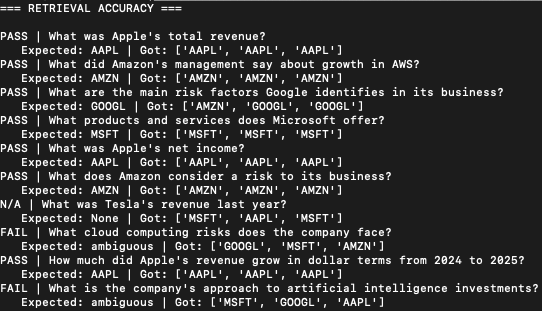
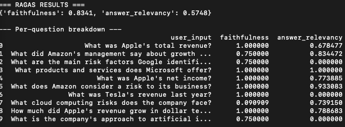

# Financial RAG: Ask Big Tech's Annual Reports

## Overview

This project is an end-to-end Retrieval-Augmented Generation (RAG) system
built to practice and demonstrate the full RAG pipeline in practice — not
just the theory. It answers financial questions about Apple, Amazon,
Alphabet (Google), and Microsoft using their actual SEC 10-K filings,
grounding every answer in real retrieved text rather than the LLM's general
training knowledge.

The purpose of this project was twofold: to apply RAG concepts (chunking,
embeddings, hybrid retrieval, reranking, evaluation) to a real, messy
dataset instead of a toy example, and to build every stage of the pipeline
myself — from raw data acquisition through to a working, queryable
interface — so I understand and can defend every design decision.

## 1. Data Handling

### Source

The knowledge base comes directly from **SEC EDGAR**, the U.S. Securities
and Exchange Commission's public filing system. Every U.S. public company
is legally required to file annual reports (Form 10-K) here, making it a
free, authoritative, and consistently structured data source.

### Companies and documents

The most recent 10-K filing (fiscal year 2025) for four companies:
**Apple (AAPL)**, **Amazon (AMZN)**, **Alphabet/Google (GOOGL)**, and
**Microsoft (MSFT)**.

### The data pipeline

1. **Ingestion** — a script pulls each company's latest 10-K directly from
   SEC EDGAR's public API (`sec-edgar-downloader`), no manual downloading.
2. **Extraction** — each downloaded filing is actually a bundle of ~90
   separate documents (the report itself, legal exhibits, XBRL
   machine-readable data, images) concatenated into one file. This step
   locates and extracts just the actual 10-K document from that bundle.
3. **Cleaning** — the extracted 10-K is raw HTML with embedded XBRL
   tagging. This step strips all markup using BeautifulSoup, removes
   hidden metadata blocks, and normalizes non-breaking space characters
   into regular spaces (a real bug found during development — see below).
4. **Sectioning** — a 10-K contains ~20 standardized "Items" (Item 1
   through Item 16). During this step, I identified that only **four
   specific Items are actually relevant to financial Q&A**:
   - **Item 1 (Business)** — what the company does, giving general context
   - **Item 1A (Risk Factors)** — risks the company discloses
   - **Item 7 (MD&A)** — management's narrative explanation of financial
     results (the "why" behind the numbers)
   - **Item 8 (Financial Statements)** — the actual numbers: income
     statement, balance sheet, cash flow statement

   The other ~16 Items (executive compensation, legal boilerplate,
   director bios, etc.) were deliberately excluded, since they add no
   value to financial Q&A and would only dilute retrieval quality.

### Real data-quality issues found and fixed

Working with genuine filings surfaced non-obvious, real-world bugs:
- **Different filing vendors, different markup.** Microsoft's filing
  agent (DFIN) produces roughly 4x denser HTML than the other three
  companies' agent (Workiva), for a similar amount of actual content.
- **Inconsistent heading capitalization.** Google's filing uses
  `ITEM 7.` (uppercase); Apple's uses `Item 7.` — required
  case-insensitive section-matching, with normalization afterward.
- **Silent truncation from non-breaking spaces.** Amazon's filing mixes
  regular and non-breaking space characters (`\xa0`, from HTML `&nbsp;`)
  inconsistently around section headings. This caused two sections to be
  silently reduced to a few characters each — no error was thrown, just
  wrong data — and required writing a diagnostic script to trace and fix.

## 2. Chunking, Embedding, Weaviate, Hybrid Search, Reranking

### Chunking

Each of the 4 retained Items is split into overlapping ~200-word chunks
(50-word overlap), rather than embedding an entire Item as one block. This
avoids retrieving overly broad, unfocused text, and the overlap prevents
sentences from being cut in half across chunk boundaries — a real risk in
financial writing, where a claim and its explanation often sit in the same
sentence. Every chunk is tagged with metadata: which company (`ticker`)
and which Item it came from.

### Embedding

Chunk text is converted into dense vectors using **`sentence-transformers`
with the `all-MiniLM-L6-v2` model** — a compact (~80MB), fast, widely-used
general-purpose embedding model that produces 384-dimension vectors. This
model runs locally with no API cost or external dependency, and was chosen
for its established balance of speed and quality for a project of this
scope.

### Weaviate (vector database)

Embedded chunks, along with their metadata, are stored in **Weaviate**,
self-hosted locally via Docker. Weaviate was chosen over a purely in-memory
solution because it's genuine production-grade infrastructure: it persists
data to disk, supports metadata filtering, and — critically — supports
hybrid search natively in a single query.

### Hybrid search (BM25 + dense)

Retrieval combines two methods in one Weaviate query:
- **BM25** — keyword-based search, strong on exact terms (tickers, exact
  financial terminology)
- **Dense vector search** — semantic search using the embeddings above,
  strong on paraphrased or conceptually related questions

These are blended using Weaviate's `alpha` parameter, which weights the
semantic side of the blend (`alpha=1` = pure dense, `alpha=0` = pure BM25).

### Reranking

Since hybrid search retrieves a wider candidate pool (10 chunks) fast but
imprecisely, a **cross-encoder** (`cross-encoder/ms-marco-MiniLM-L-6-v2`)
reranks those candidates by feeding the query and each candidate chunk
*together* into one model — far more accurate at judging true relevance
than the bi-encoder-based hybrid search alone, at the cost of being too
slow to run against the full dataset directly. The top 3 reranked chunks
are what actually get passed to generation.

## 3. Prompt + LLM Generation

### Prompt construction

Retrieved, reranked chunks are assembled into a structured prompt
following a standard RAG template: system instructions (answer only from
provided context, cite sources, admit when information is missing) +
labeled context blocks (`[Source: TICKER, Item X.]`) + the user's
question.

### LLM call

The final prompt is sent to **Claude** (Anthropic API), with
**temperature set low (0.2)** deliberately — low temperature keeps the
model's output faithful to the retrieved context rather than creatively
paraphrasing or embellishing, which matters directly for a system whose
core value is grounded, trustworthy financial information.

### Evaluation

## Retrieval accuracy

An automated test set of 10 questions checks whether the correct
company/section is actually retrieved. The questions fall into three
categories, each evaluated differently:

- **7 questions** have one clearly correct company — these are scored
  automatically (pass/fail).
- **1 question** asks about Tesla, a company not in the dataset — this
  tests graceful refusal rather than hallucination, and has no
  "correct ticker" to check against, so it's excluded from the
  pass/fail count and reviewed separately.
- **2 questions** are deliberately ambiguous across multiple companies
  (e.g. "cloud computing risks," relevant to Amazon, Google, *and*
  Microsoft) — these also have no single correct ticker, so they're
  excluded from the automated count and reviewed manually instead.

**Result: 7/7 (100%) retrieval accuracy on the 7 questions with a single
correct answer.** The remaining 3 questions (1 out-of-scope, 2 ambiguous)
aren't included in that ratio because "correct" isn't a single ticker for
them — they're assessed qualitatively instead: the out-of-scope question
correctly triggered a refusal rather than a hallucinated answer, and
both ambiguous questions correctly surfaced only genuinely relevant
companies (e.g. Apple — which has no major cloud business — was
correctly excluded from the cloud-computing question).



*Note: the two "FAIL" labels above are a known limitation of the current
scoring script — it only distinguishes exact-match questions from the
`None` (out-of-scope) case, and doesn't yet have a distinct category for
deliberately ambiguous questions. Both "failed" results are correct on
manual review (see explanation above).*

## Answer quality (RAGAS)

Used [RAGAS](https://docs.ragas.io) with an independent LLM judge
(OpenAI GPT-4o mini — deliberately different from the Claude model used
for generation, to avoid self-preference bias) to score two metrics:

- **Faithfulness** — are the claims in the generated answer actually
  supported by the retrieved context?
- **Answer Relevancy** — does the answer genuinely address the question
  asked?

**Test questions:**

### Why Answer Relevancy is lower and inconsistent

**Faithfulness** checks whether each claim in an answer traces back to
retrieved context. **Answer Relevancy** works differently: the judge LLM
generates hypothetical questions the answer *would* suit, then measures
their similarity to the actual question — a low score here can reflect
phrasing differences, not necessarily wrong content.

Three questions consistently scored 0 on relevancy across runs:

- **Question 7 (Tesla)** is a **correct refusal**, not a failure — Tesla
  isn't in the dataset, and the system correctly declined rather than
  hallucinating. Because a refusal doesn't directly "answer" the literal
  question, the metric penalizes it by design — a known limitation of
  Answer Relevancy applied to intentional refusals.
- **Questions 3 and 10** (Google risk factors, AI investment approach)
  are genuinely answerable, and their persistent 0 scores across runs
  are worth further investigation — likely caused by citation-heavy,
  structured phrasing diverging from the question's natural wording.

### A second, important finding: run-to-run variance in the judge's scoring

Running the same evaluation twice produced **meaningfully different
Faithfulness scores** for several questions — notably Question 8 (cloud
computing risks), which dropped from 0.636 in one run to 0.091 in
another, and Question 10, which dropped from 0.917 to 0.750. The overall
Faithfulness average shifted from 0.920 to 0.834 between runs.

This variance traces to a specific, documented constraint: newer Claude
models reject an explicit low-temperature setting for structured judge
calls, so the RAGAS judge (via `llm_factory`) had to run at
**temperature=1.0** rather than a low, more deterministic setting — a
limitation of the current model/library combination, not a design
choice. This is a known tradeoff worth being transparent about: the
*relative* pattern across questions (Tesla and ambiguous questions
scoring lowest) is consistent between runs, but exact scores should be
read as indicative rather than perfectly precise, and averaging multiple
runs would give a more statistically stable result than any single run.

**Takeaway:** the system is consistently trustworthy in avoiding
fabricated claims (Faithfulness stays high across runs), while Answer
Relevancy reliably flags the same three questions as needing attention —
a stable, interpretable signal even though the exact numeric scores
carry some run-to-run noise from the judge's forced sampling temperature.

### Interface

A Streamlit UI provides a simple front end: a question box, clickable
example questions, and expandable source citations under every answer, so
users can inspect exactly which retrieved text an answer is grounded in.

## Tech stack

Python · `uv` · `sec-edgar-downloader` · BeautifulSoup ·
`sentence-transformers` (`all-MiniLM-L6-v2`) · Weaviate ·
`cross-encoder/ms-marco-MiniLM-L-6-v2` · Anthropic Claude · RAGAS ·
Streamlit

## Running it locally

```bash
uv sync
docker run -d -p 8080:8080 -p 50051:50051 cr.weaviate.io/semitechnologies/weaviate:latest

# Add your key to .env (see .env.example): ANTHROPIC_API_KEY=your_key and OPENAI_API_KEY=your_key

uv run src/financial_rag/ingestion.py
uv run src/financial_rag/extraction_10K.py
uv run src/financial_rag/cleaning.py
uv run src/financial_rag/sectioning.py
uv run src/financial_rag/chunking.py
uv run src/financial_rag/vectorstore.py

uv run streamlit run app/ui.py
```

## Known limitations

- Item 8's financial tables are currently chunked as plain text rather
  than preserving row/column structure, which limits precision on purely
  numeric lookups.
- Covers 4 companies and a single fiscal year; not yet set up for
  incremental updates as new filings are released.